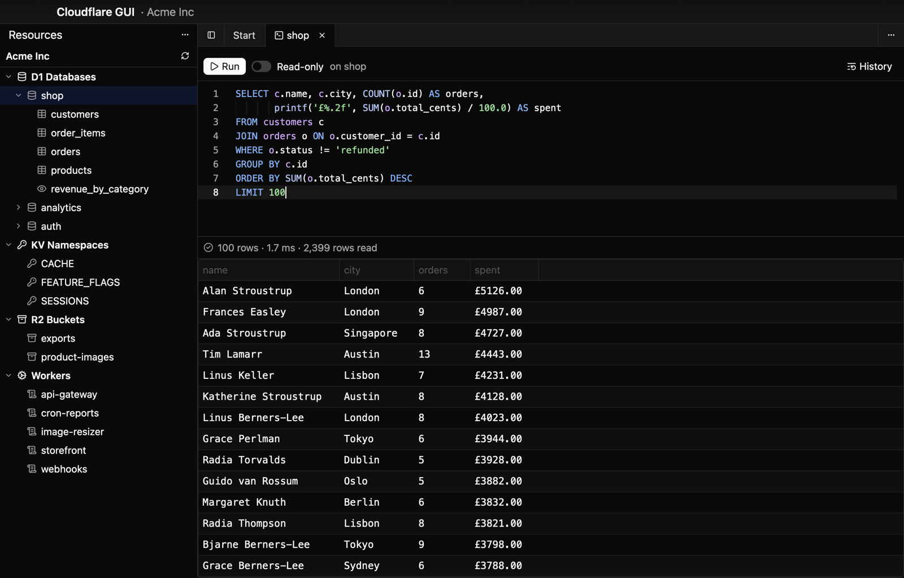
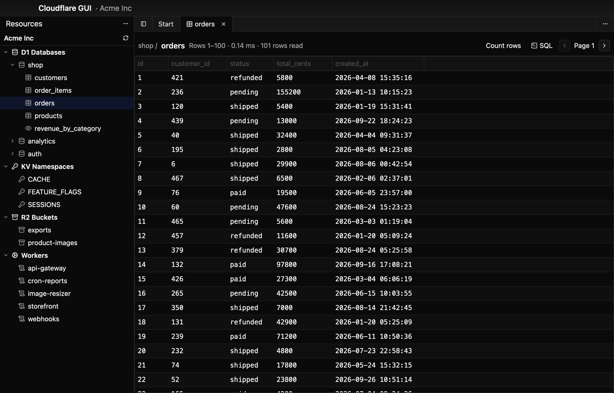
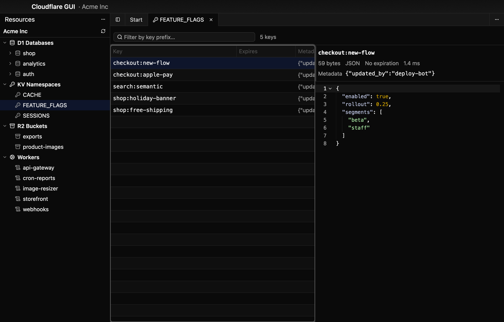
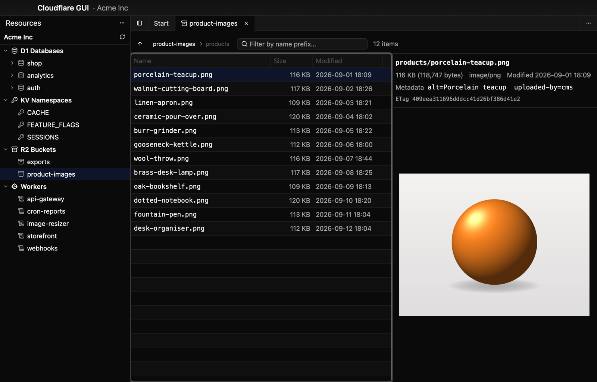
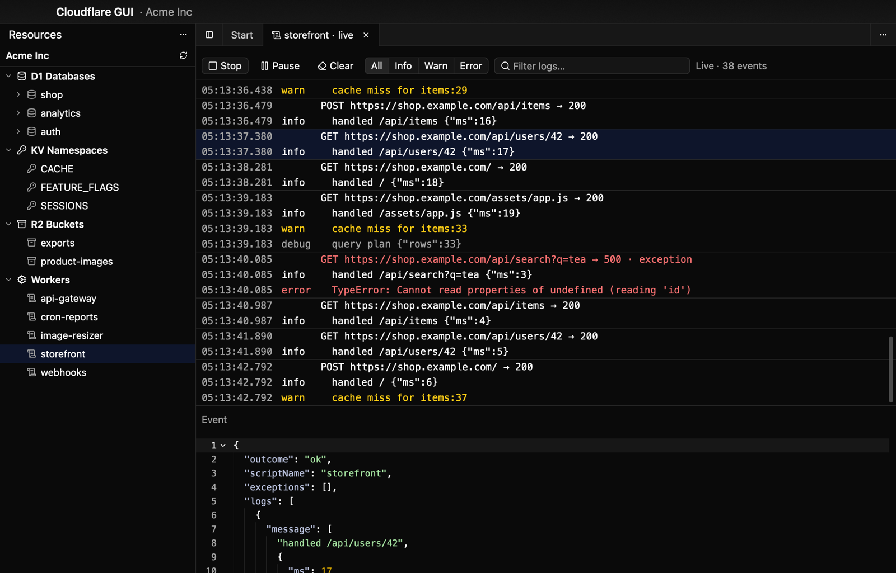
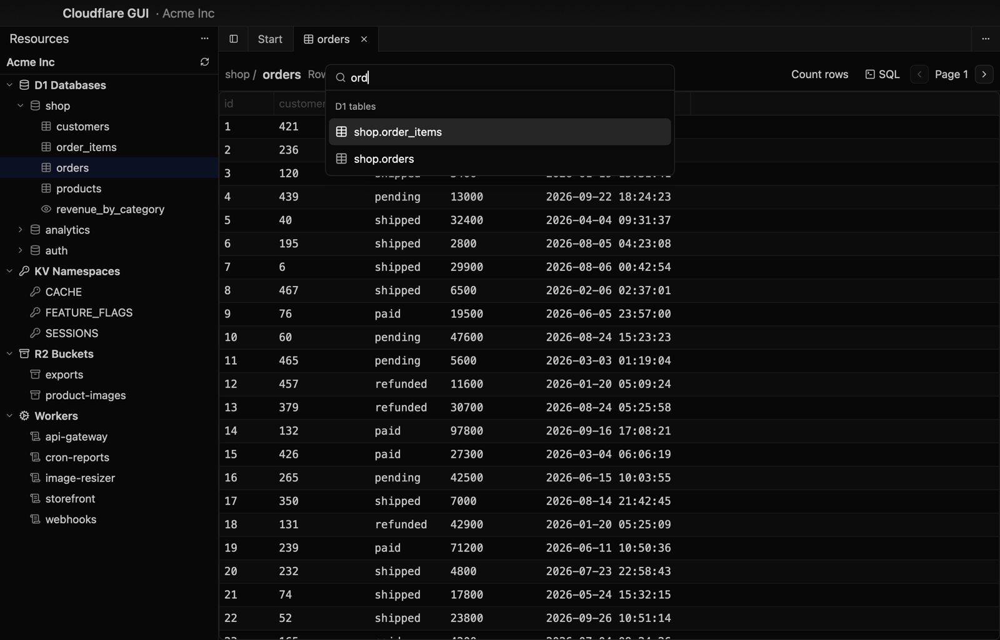

<div align="center">

# Cloudflare GUI

**A fast, keyboard-driven native macOS console for Cloudflare D1, KV, R2 and live Worker logs.**

Think TablePlus for your Cloudflare account: browse tables and run SQL, explore KV namespaces and
R2 buckets, and tail Worker logs, all in one native window.

[](https://github.com/rcnsh/cloudflare-gui/actions/workflows/check.yml)
[](https://github.com/rcnsh/cloudflare-gui/releases/latest)


[](LICENSE)



</div>

> Screenshots come from the built-in [demo mode](#try-it-without-an-account), with invented data.

## Features

<table>
<tr>
<td width="50%" valign="top">

### D1
Browse any table page by page, or open an SQL tab with highlighting. **⌘↩** runs the
selection or the whole buffer. Row counts, timings, rows read and errors show inline, and every
database keeps its own query history.

</td>
<td width="50%" valign="top">

### Workers KV
Search keys by prefix. Keys load page by page as you scroll. Values open in a viewer that
pretty-prints JSON and shows metadata and expiry.

</td>
</tr>
<tr>
<td></td>
<td></td>
</tr>
<tr>
<td width="50%" valign="top">

### R2
Browse buckets folder by folder, with sizes and modified times. Preview images, JSON and text,
with custom metadata and ETags. Previews read at most 8 MB, so huge objects never download in
full.

</td>
<td width="50%" valign="top">

### Live Worker logs
Stream a Worker's invocations as they happen. Filter by level or text, pause without losing
events, and click any line to see the full event.

</td>
</tr>
<tr>
<td></td>
<td></td>
</tr>
</table>

**And everywhere:**
- **⌘K jumps to any database, table, namespace, bucket or Worker.** It searches what's already
  loaded, so it never sends a request.
- **Tabs** in a dock layout. Every major action has a shortcut and a menu item.
- **Polite to the API.** Resource lists are cached until you refresh. Rate limits and server
  errors are backed off and retried, and anything that writes is never retried.

<p align="center"></p>

## Safe by default

The app is **read-only unless you say otherwise**:

- SQL is classified before it's sent. Anything that isn't a plain `SELECT`, `EXPLAIN` or
  read-only `PRAGMA` is blocked unless you turn on write mode for that tab. Even then, you must
  confirm a dialog showing the exact statement and the target database. The API client checks
  the classification again, so a UI bug can't send a write in read-only mode.
- Your API token lives only in the macOS login Keychain. It's never written to disk, logged or
  shown.
- A live tail creates a short-lived tail session on the Worker. That only happens when you press
  **Start**, and the session is deleted when you stop, close the tab or quit.

## Install

1. Download `Cloudflare-GUI-<version>-macos-universal.zip` from the
   [latest release](https://github.com/rcnsh/cloudflare-gui/releases/latest). It runs natively on
   Apple Silicon and Intel.
2. Unzip it and move **Cloudflare GUI.app** to `/Applications`.
3. The app isn't notarized, so the first launch is blocked. Open **System Settings → Privacy &
   Security** and click **Open Anyway**, or run:

   ```sh
   xattr -dr com.apple.quarantine "/Applications/Cloudflare GUI.app"
   ```

4. Paste an API token (see below) and pick an account.

When macOS asks whether the app may use the token stored in your Keychain, click
**Always Allow**. Release builds are signed ad hoc, so macOS asks once more after each update.

### Build from source

You need the Rust toolchain and the Xcode Command Line Tools (`xcode-select --install`). The full
Xcode isn't required, because the Metal shaders compile at launch.

```sh
git clone https://github.com/rcnsh/cloudflare-gui
cd cloudflare-gui
cargo run --release
```

## API token

Create a token at **dash.cloudflare.com → My Profile → API Tokens → Create Token → Create Custom
Token**, scoped to the account you want to browse.

| Permission (Account)   | Access | Used for                                 |
| ---------------------- | ------ | ---------------------------------------- |
| Account Settings       | Read   | Listing accounts for the account picker  |
| D1                     | Read   | Listing databases, running read queries  |
| Workers KV Storage     | Read   | Namespaces, keys, values and metadata    |
| Workers R2 Storage     | Read   | Buckets, object listings and previews    |
| Workers Scripts        | Read   | Listing Workers                          |
| Workers Tail           | Read   | Live Worker logs                         |

R2 goes through the REST API with this same token, so you **don't need S3 access keys**. Add
**D1 · Edit** only if you want to run statements that write. The app still asks you to confirm
each one.

## Keyboard

| Keys              | Action                                       |
| ----------------- | -------------------------------------------- |
| ⌘K / ⌘P           | Command palette                              |
| ⌘R                | Refresh resource lists                       |
| ⌘B                | Show or hide the sidebar                     |
| ⌘T                | New SQL tab                                  |
| ⌘W                | Close tab                                    |
| ⌘↩                | Run query (SQL) · start or stop a tail (logs) |
| ⇧⌘W               | Toggle write mode (SQL)                      |
| ⌘] / ⌘[           | Next / previous page (table browser)         |
| ⌘F                | Focus search or filter                       |
| ↩ / ⌫ / ⌘↑        | Open folder / go to parent folder (R2)       |
| ⌘.                | Pause or resume logs                         |
| ⇧⌘K               | Clear logs                                   |
| ⇧⌘D               | Toggle dark mode                             |

## Try it without an account

The development build has an offline demo account. It runs a fake Cloudflare API on localhost,
and D1 is a real in-memory SQLite database, so any SQL you type runs. Demo mode never reads or
writes your Keychain or settings.

```sh
CFGUI_DEMO=1 cargo run --features devtools
```

## Where things are stored

- **API token:** login Keychain, service `dev.cloudflare-gui.api-token`.
- **Settings and query history:** `~/Library/Application Support/cloudflare-gui/`. Nothing in
  there is secret.

## Development

Built with [GPUI](https://gpui.rs) and [gpui-component](https://github.com/longbridge/gpui-component),
[reqwest](https://github.com/seanmonstar/reqwest) and [tokio](https://tokio.rs). It talks to the
[Cloudflare REST API](https://developers.cloudflare.com/api/) directly.

```sh
./script/check        # fmt, clippy (with and without devtools), tests. CI runs the same
```

`CLAUDE.md` covers the module layout, the pinned GPUI versions and how to upgrade them, the
scripted UI runner used for screenshots, and the project's safety rules.

To cut a release, bump `version` in `Cargo.toml`, commit, then push a matching tag
(`git tag v0.2.0 && git push origin v0.2.0`). The release workflow builds the universal app and
publishes it.

## License

[MIT](LICENSE)
